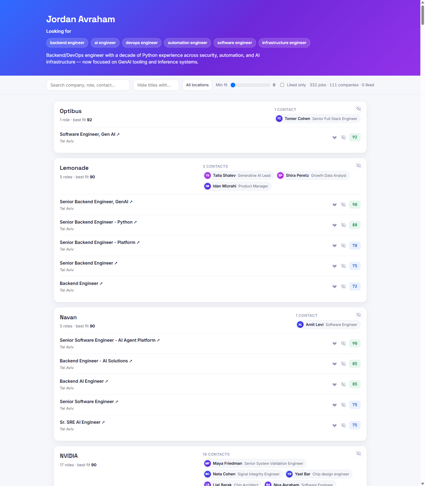

# LinkedIn Match

This is a Claude Code skill. It looks at your LinkedIn connections and your CV,
then finds open jobs at companies where you already know someone who works
there. It can give you a quick ranked list, or a full HTML report where each
job is scored against your CV by Claude.

Everything runs on your own machine. Nothing is sent to a third party, and no
API key is needed.

Here is what the report looks like.




## Step 1: Get your LinkedIn connections file

Go to LinkedIn's [Get a copy of your data](https://www.linkedin.com/mypreferences/d/download-my-data)
page, choose "Download larger data archive" (the other option skips
connections), then click "Request archive". LinkedIn emails you when it's
ready, anywhere from a few minutes to about a day. Download it, unzip it, and
you'll find `Connections.csv` inside. Keep it, along with your CV, in a folder
you'll remember.

## Step 2: Install the skill

Open Claude Code and run these two commands:

```
/plugin marketplace add hanegbi/linkedin-match
/plugin install linkedin-match@linkedin-match
```

That's it. Nothing to build, nothing to configure ahead of time.

## Step 3: Run it

In a Claude Code chat, type:

```
/linkedin-match
```

Claude will ask where your `Connections.csv` and CV are, ask which job titles
you're interested in, and then do the rest: scrape open jobs, match them
against your connections, and build the report. The first time it runs, it
quietly sets up its own Python environment, so it may take a minute before you
see progress.

## License

MIT. Full terms are in [LICENSE.txt](LICENSE.txt).
